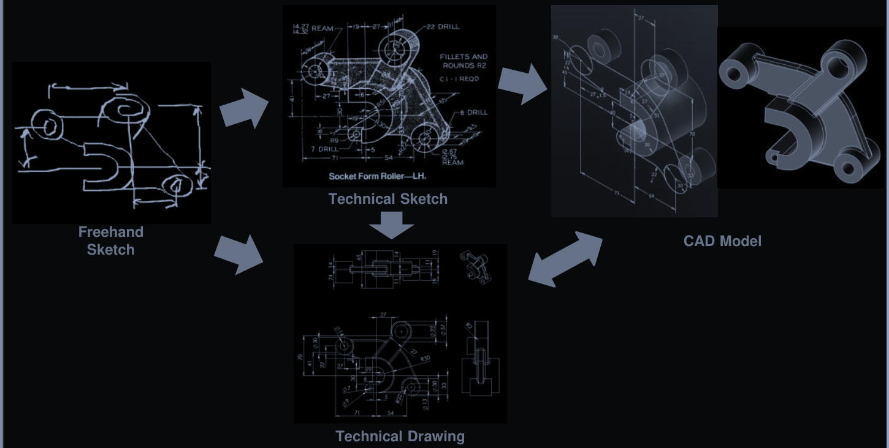
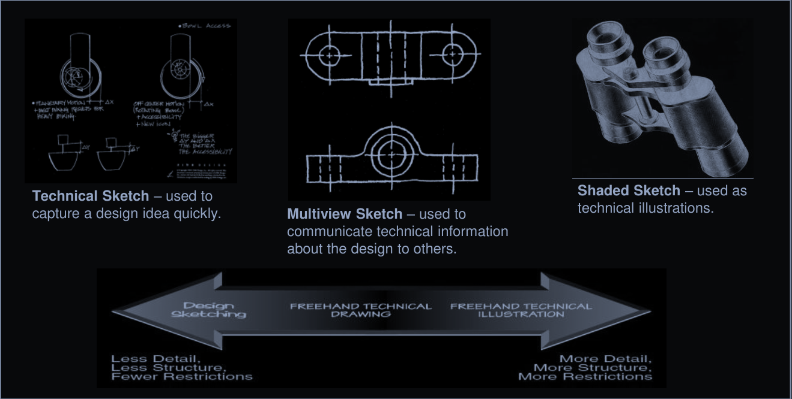

# Engineering Design Process & Drawing Techniques

## 1. Engineering Design Process

The engineering process is **a series of steps** that engineers follow to come up with a **solution to a problem**

The process is highly **iterative** - parts of the process often need to be **repeated many times** before another can e entered 

The process changes **depending** on how the engineering product innovate is driven, whether
- **Demand-Pull innovation**
- **Invention-Push**

### 1.1 Problem/Product Definition

To identify the requirement for the product sometimes called:
- Product Planning
- Need Analysis
- Task Classification

Typically, one of the most critical design step for the **New Product Development (NPD)**

The task is given to `engineers` and `designers` by the `marketing department` or `client` to provide a comprehensive **Product Design Specification (PDS)** decument which includes a requirement list factors:
- Technical
- Economic
- Quality

### 1.2 Conceptual Design

An early phase of the *Product Design Process*, in which the broad outlines of the function and form of something are articulated

### 1.3 Preliminary Design

More detailed engineering design/analysis calculation are performed on at least the major elements of the component

> [!NOTE]
> Also referred as **embodiment design**
> Which may involve another three sub-stages:
> - Product architecture
> - Design configuration
> - Parametric design

### 1.3 Detailed Design

> [!NOTE]
> The **Preliminary Design** is completed and `detailed specification` of each part and assembly is produced

Detailed design may include:
- Detailed drawing
- OEM component specification
- Bill of materials (BOM)
- Production notes
- Operation instructions

### 1.4 Design Communication

To communicate the results in the form of:
- Reports
- Presentations
- Display boards *or a combination of methods*

Through `documentation` allows the finished product to be manufactured to the required **quality standards**

  
Example

  

## 2. Technical Drawings

Technical drawing is a drawing that visually expresses how something *function* and is to be *constructed*

Technical drawing is made up of **Graphic Communication** which included these elements:
  -  Symbols
  - Images

- **Sketching**
  - Sketching is an important of method of *quickly communicating design ideas*. Therefore, learning to sketch is necessary for any person working in a technical work 
  - Sketching is as much *a way of thinking* as it *method of recording ideas* and *communicating* to others
  - For now, we will focus on **technical sketching** which is the process of producing a *rough preliminary drawing* representing the main features of a product or structure

### 2.1 Technical sketch

- There are these method of creating technical sketches:
  - Freehand
  - Mechanical
  - Digital

- A `technical drawing` may *communicate only slected details of an object* using lines
- The **level of details (LOD)** needs *not to be uniform across the sketch*

### 2.2 Freehand technical drawing

  

### 2.3 Multiview & Pictorial drawing

To communicate technical information about the design, 2 archetypes of sketches are used. They are **Multiview sketches** and **Pictorial Sketches**

#### 2.3.1 Multiview

