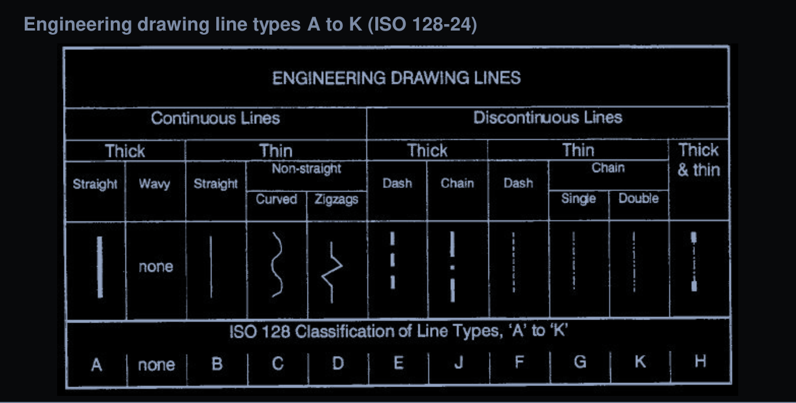

# Lecture 2 - Technical drawing and 3d Modelling

## 1. Technical Drawing Fundamentals

### 1.1 Drawing Types

- **Pictorial Drawing**

  

- **Multiview Drawing**

  

### 1.2 Drawing Lines

Engineering drawing line types A to K [`iso 128-24`](https://www.url.com)

  

- [Drawing lines application](#drawing-lines) 

  
  

### 1.3 Dimension purpose & Guidelines

- The **purpose** of dimensioning is to provide a clear and complete description of an object
- A complete set of dimensions will permit only one interpretation needed to construct the part
- Dimensioning should follow these guidelines:
  - **Accuracy:** correct value must be given
  - **Clearness:** dimensions must be placed in appropriate positions
  - **Completeness:** nothing must be left out, and nothing duplicated
  - **Readability:** the appropriate line quality must be used for legibility

#### 1.3.1 Dimensioning in Practice

- As a general `guideline` to dimensioning, try to think that you would make an object and dimension it in the most useful way
- *Put in exactly* as many dimension as are necessary for the craftspersons (production) to make it **-no more, no less**
- Do not put in redundant dimensions

#### 1.3.2 Dimension Groups

1. **Outer dimensions:**
  - Bolt diameter
  - Sheet-metal thickness

2. **Inner dimensions:**
  - Hole diameter
  - [groove](https://en.wikipedia.org/wiki/Groove_(engineering)) width
  - Connect alternate surfaces
  - Elements of the same surface

3. **Fan dimensions:**
  - Step length
  - Groove depth
  - Used between equal oriented surfaces (*and can only be measured with an `auxiliary` tool*) `=>` this kind dimension should be defined with a clear drawing enrollment 

4. **Distance dimensions:**
  - Hole center distance
  - Pitch dimensions
  - have an extraordinary status 
  (*Because it is no real dimension tolerance but rather position tolerance*)

  

5. **Functional dimensions:**
  - Critical to correct function of the components
  - More important when making decision in design and QC

6. **Non-Functional dimensions:**
  - Less important and will not affect the function

7. **Auxiliary dimensions:**
  - For information (assistance) only
  - Dimension value shall be placed into parenthesis `()`
